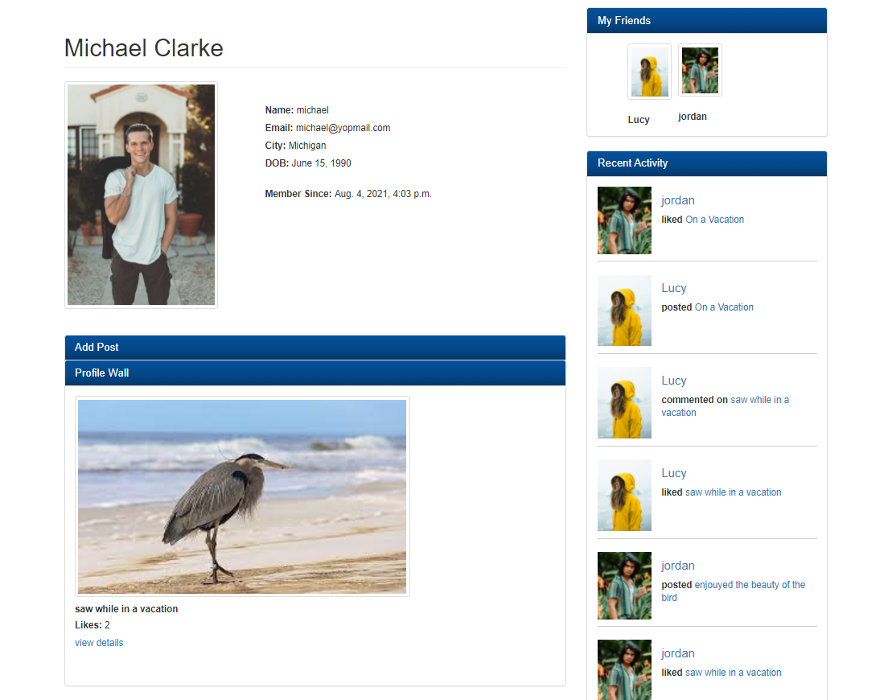
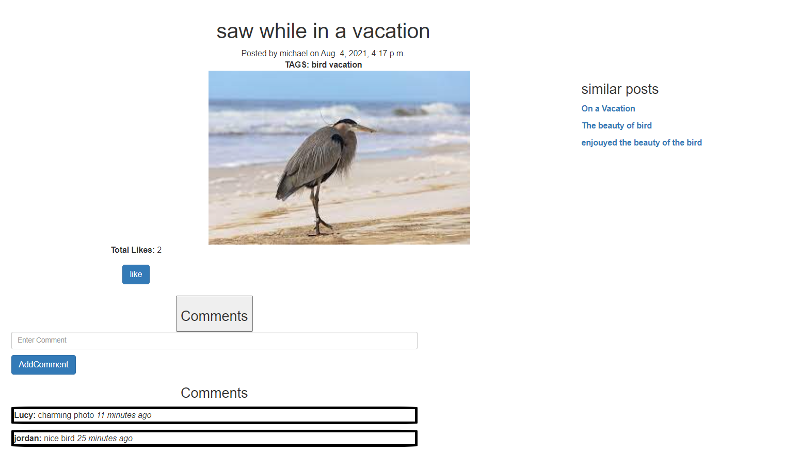

# Image-sharing-social-media
This is a Image sharing social media website built with django 
 
## Features 

###   User registration, Email authentication
###   User can post Image  
###   User can like comment in post 
###   User can follow other users  
###   similar post suggesstion 
###   User can view recent activity of other users  
###   Used Celery to send email as asynchronous  task 
###   Used django signals to optimize query cost
###   Used view cache in home page for better performance

## Screenshots

---

## to run  in local  machine 

create a virtual env. then install all dependencies from requirements.txt.
connect postgresql  , rabbitmq and a cache engine in share_image/share_image/settings.py file 
then run the application 
 

